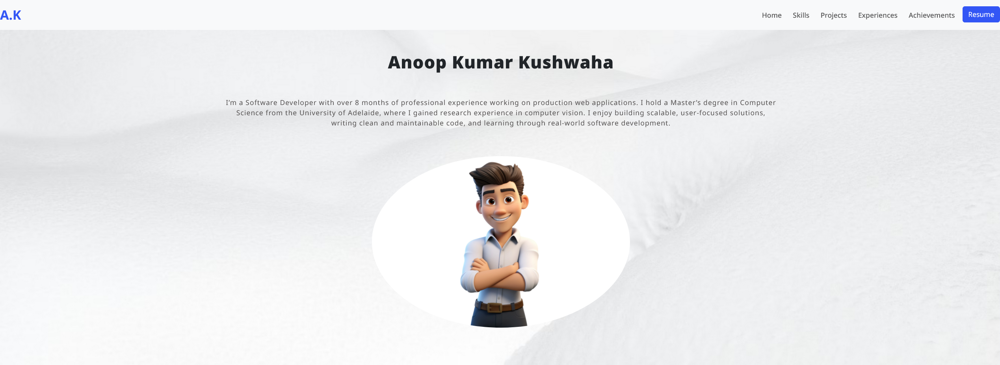
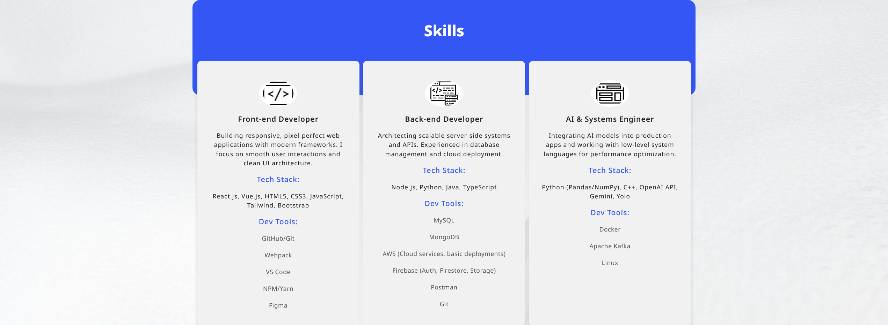
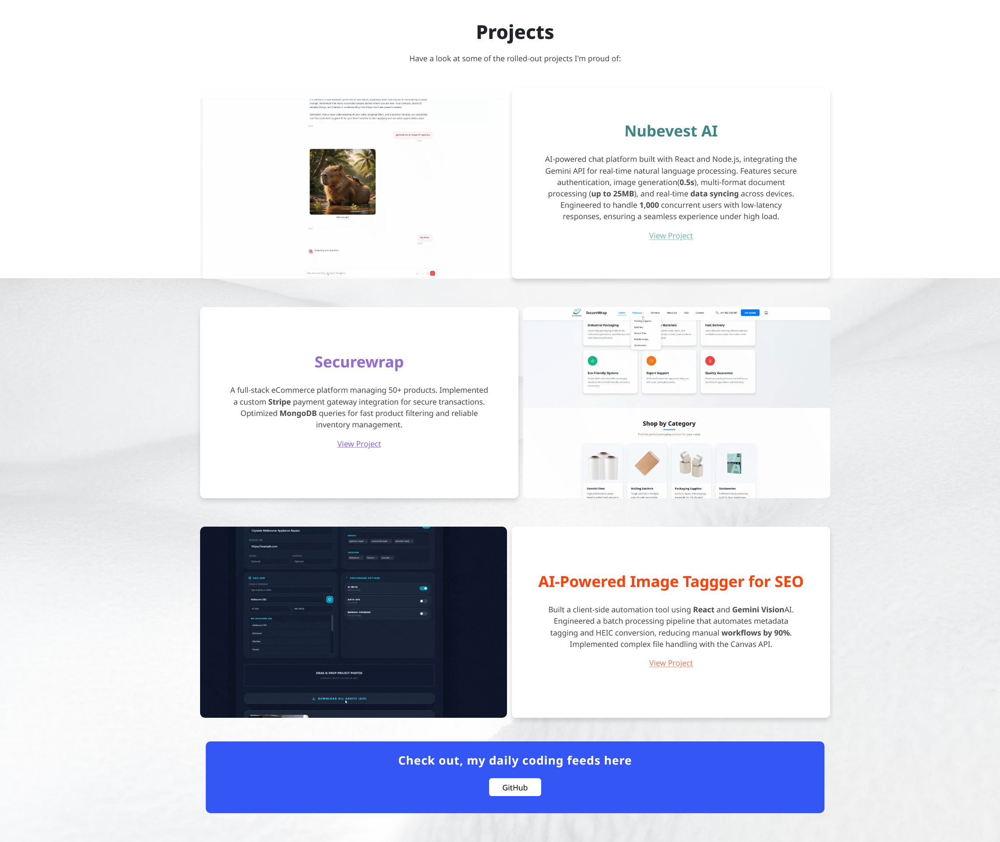

# Anoop Kumar Kushwaha - Portfolio 🌐

Welcome to my personal portfolio website! Here, you can explore my projects, skills, and experiences in software development.

🔗 **Live Website:** [a1819644.github.io/anoop.portfolio](https://a1819644.github.io/anoop.portfolio/)

---

## 📌 About Me

Hello! I'm Anoop, an aspiring Software Engineer pursuing a Master's in Computer Science at The University of Adelaide. I specialize in backend and full-stack development, with a passion for creating efficient and scalable solutions.

🔗 **LinkedIn:** [Anoop Kumar Kushwaha](https://www.linkedin.com/in/anoop-kumar-khushwaha-b16b64218)

---

## 🚀 Technologies & Tools

- **Languages:** Python, JavaScript, Java, Dart
- **Frameworks:** Django, React, Flutter
- **Tools:** Git, Docker, Jenkins

---

## 📂 Projects

Here are some of the projects I've worked on:

### 1. [Nubevest AI](https://ai.nubevest.com.au/)

AI-powered chat platform built with React and Node.js, integrating the Gemini API for real-time natural language processing. Features secure authentication, image generation (0.5s), multi-format document processing (up to 25MB), and real-time data syncing across devices. Engineered to handle 1,000 concurrent users with low-latency responses, ensuring a seamless experience under high load.

### 2. [Securewrap](https://securewrap.com.au)

A full-stack eCommerce platform managing 50+ products. Implemented a custom Stripe payment gateway integration for secure transactions. Optimized MongoDB queries for fast product filtering and reliable inventory management.

### 3. [AI-Powered Image Tagger for SEO](https://github.com/a1819644/ai-image-tagger)

Built a client-side automation tool using React and Gemini Vision AI. Engineered a batch processing pipeline that automates metadata tagging and HEIC conversion, reducing manual workflows by 90%. Implemented complex file handling with the Canvas API.


---

## 📷 Screenshots

### Home Section


### Skills Section 


### Projects Section 


### Experiences Section 


### Achievements Section 


---

## 📂 How to Use This Repo

To explore or contribute to this portfolio:

   ```sh
   git clone https://github.com/a1819644/anoop.portfolio.git
   cd anoop.portfolio
   npm install
   npm run dev
